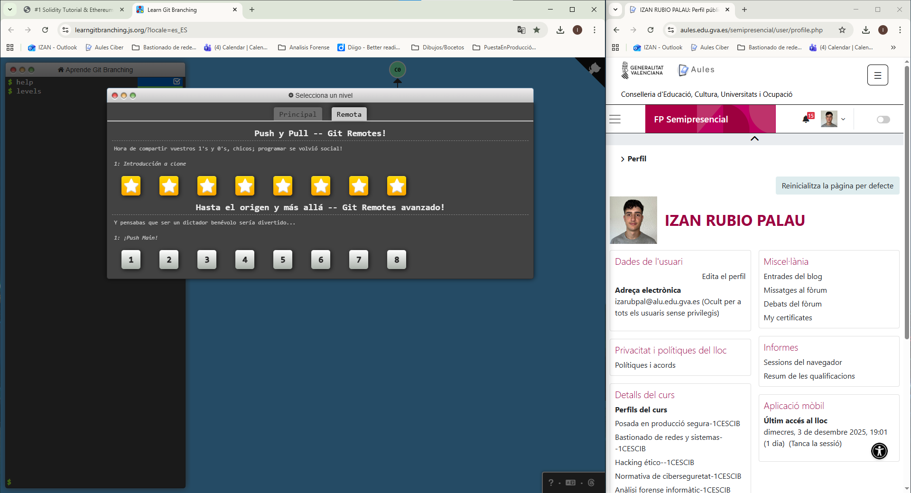

# Práctica Puntuable RA1 – PPS 25_26

## Apartado 3

En este apartado se han realizado los ejercicios del tutorial **Learn Git Branching** (https://learngitbranching.js.org/) para practicar la gestión de ramas en **Git**.  
El objetivo era completar la práctica de la actividad **ACT_RA1_4: Solidity + GIT**, y obtener pantallazos tanto de la pestaña **Main** como de la pestaña **Remote**, dejando claro que los resultados son propios.

### Bienvenida del tutorial

Al abrir la web, aparece el siguiente mensaje de bienvenida:

> ¡Bienvenid@ a Learn Git Branching!   
Esta aplicación está diseñada para ayudar a los principiantes a manejar los poderosos conceptos que hay detrás del trabajo con ramas (branches) en Git. Esperamos que disfrutes la aplicación y tal vez incluso ¡que aprendas algo!

## Descripción de las capturas

Se han realizado las operaciones indicadas en la práctica, utilizando comandos básicos y avanzados de Git dentro del simulador de Learn Git Branching.  

Se han obtenido dos capturas principales:

1. **Main.png** – Muestra la rama principal (`main`) con los commits realizados y las ramas locales generadas durante la práctica.  
2. **Remote.png** – Muestra la vista remota (`remote`) con los cambios reflejados en la rama remota y la sincronización con la rama principal.

Estas imágenes permiten visualizar de forma clara el flujo de trabajo con ramas, los commits y la interacción entre la rama local y la remota.

## Utilidad del tutorial

El tutorial de Learn Git Branching es muy útil para:

- Comprender la creación y gestión de **branches** en Git.  
- Practicar la **fusión de ramas** (merge) y resolución de conflictos.  
- Visualizar cómo se reflejan los cambios locales en un **repositorio remoto**.  
- Prepararse para proyectos que utilicen Git de forma colaborativa y organizada.

## Imágenes del apartado

**Main:**

**Resultado obtenido por el alumno Izan Rubio Palau.**

**Remote:**

**Resultado obtenido por el alumno Izan Rubio Palau.**

> Las imágenes mostradas son **resultados propios** obtenidos durante la práctica, y no han sido descargadas de Internet ni copiadas de terceros.

## Conclusión

Este apartado demuestra la capacidad de trabajar con **Git y ramas**, así como de documentar los resultados de forma clara mediante capturas de pantalla.  
La práctica refuerza los conceptos de control de versiones y la gestión de repositorios locales y remotos, conocimientos fundamentales para cualquier proyecto de desarrollo colaborativo.

## Autor

**Izan Rubio Palau**

Estudiante del módulo PPS 25_26
