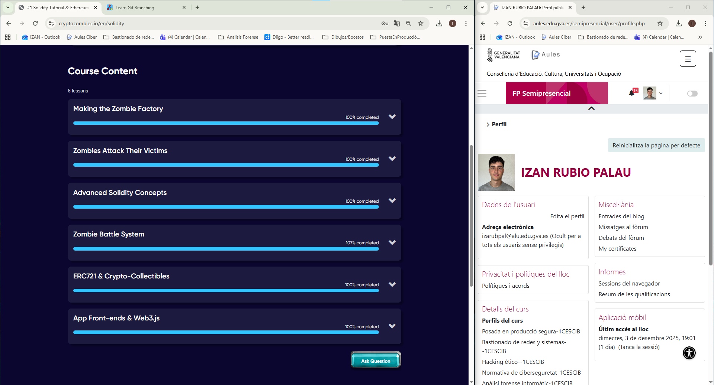
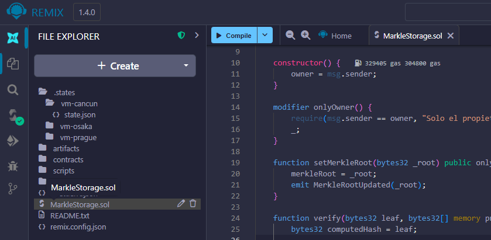
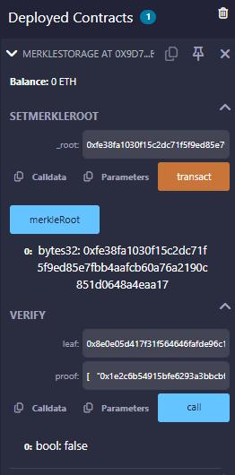

# Práctica Puntuable RA1 – PPS 25_26

## Apartado 4

En este apartado se ha trabajado con **Solidity**, el lenguaje de programación utilizado para desarrollar **Smart Contracts** sobre la blockchain de Ethereum.
El objetivo era:

- Realizar el tutorial **Solidity: Beginner to Intermediate Smart Contracts** de la práctica **ACT_RA1_4: Solidity + GIT.**
- Crear un **Smart Contract privado** propio que inicie una cadena basada en **Merkle Trees**

## ¿Qué es Solidity?

- **Solidity** es un lenguaje de alto nivel para escribir contratos inteligentes que se ejecutan en Ethereum.
- Permite definir reglas automáticas que se cumplen de manera inmutable en la blockchain.
- Se utiliza para aplicaciones descentralizadas (DApps), tokens, y sistemas de verificación como los **Merkle Trees**.

## Imágen del tutorial

**Resultado obtenido por el alumno Izan Rubio Palau.**

## Smart Contract propio

Se ha creado el siguiente contrato: `MerkleStorage.sol`

### Funcionalidad del contrato

- `setMerkleRoot(bytes32 _root)`: Permite al propietario establecer la raíz de un **Merkle Tree.**
- `verify(bytes32 leaf, bytes32[] memory proof)`: Verifica si una hoja (`leaf`) pertenece al árbol mediante la prueba (`proof`).

- Solo el propietario puede modificar la raíz, usando el **modifier** `onlyOwner`.

En un entorno real, `verify` devolvería `true` si se proporciona la hoja y el proof correctos. En este ejemplo didáctico, los valores de prueba devuelven `false`, pero el contrato funciona correctamente y se puede interactuar con él. Yo he usado Remix IDE para probarlo.

## Despliegue y uso

1. Abrir **Remix IDE (https://remix.ethereum.org/)**.
2. **Crear** un nuevo archivo `.sol` con el código del contrato.  

3. **Compilar** el contrato desde la pestaña Solidity Compiler.  

4. En la pestaña **Deploy & Run Transactions**, seleccionar el entorno JavaScript VM (Cancun) y desplegar el contrato.  

5. Una vez hecho el deploy, ya podremos **interactuar con el contrato**.  

## Conclusión

Este apartado ha permitido trabajar con **Solidity**, entendiendo cómo se crean y despliegan Smart Contracts en un entorno real como Remix IDE.  
Además, se ha desarrollado un contrato propio basado en **Merkle Trees**, uno de los mecanismos de verificación más utilizados en blockchain por su eficiencia y seguridad.

Con este ejercicio se refuerzan los conceptos básicos sobre desarrollo en Ethereum, gestión de estados dentro de un contrato inteligente y uso de pruebas criptográficas como las estructuras de Merkle.

## Autor

**Izan Rubio Palau**

Estudiante del módulo PPS 25_26